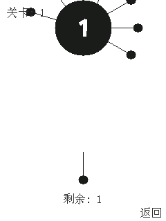
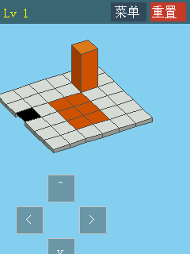
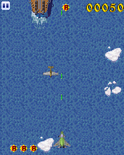

# 在线商店第二轮：430 项复测、持续运行与音频

后续进展：[第三轮 317 项复测](2026-09-14-store-round3.md)，本页保留第二轮历史结果。

本轮接续 [第一轮报告](2026-09-14-store.md)，使用相同的 2640 个 MD5 冻结包，重点处理前轮未通过冒烟的 430 项。**113 项转为冒烟通过**，原 430 项还剩 **317 项未通过**。全量通过 2323/2640，原通过项回退 0 项。不能把退出、静态画面或仅错误消失算成修复通过。

## 全量对比

| 分类 | 前轮 | 本轮 | 变化 |
|---|---:|---:|---:|
| 冒烟通过 | 2210 | 2323 | +113 |
| 静态画面 | 161 | 163 | +2 |
| 来宾退出 | 56 | 56 | +0 |
| 运行异常 | 176 | 65 | -111 |
| 黑屏 | 33 | 33 | +0 |
| 宿主超时 | 4 | 0 | -4 |

[2640 项原始结果](2026-09-14-store-round2.json) · [430 项逐项状态](2026-09-14-store-round2-issues.md) · [机器可读对照](2026-09-14-store-round2-comparison.json)。最后一轮包含按页缓存索引和 loadfile/foreach/SpriteCheck 修复，全部测试完成后才汇总，没有混用中途修改代码的结果。

## 修复内容

- **动态 ARM 代码缓存**：部分程序通过普通 `malloc/memcpy` 搬运代码，没有调用注册可执行区的接口。成功取指后为该页建立缓存，使搬运后的代码也可复用解码和编译块；所有来宾写入仍触发精确失效。后续把 region 元数据也按页索引，避免每次普通数据写入遍历所有代码区，同时去掉缓存命中的重复 region 查找。跨页 block 和重叠 region 的失效单独测试。新增测试验证运行 40 次后普通内存写入使已编译块失效并执行新指令。
- **旧 Lua 阅读器链**：让已加载 MRP 的文件头可通过普通文件句柄读取；实现 `_drawTextEx` 的 Unicode/GBK 排版、换行、裁剪和返回偏移；实现 `_loadPack`，只切换资源包，不重建 Lua、清除定时器或关闭调用方句柄。外部文件与已知包优先于当前包的同名成员。补齐 `_pCall`、位图旧名称、实际屏幕抓取 `BmGetScr/_bmpGetScr`、`phone.getNetID` 和小写目录接口。
- **可变字符串工作区**：实现 `string.new/set/update`。新建缓冲区及其 `string.sub` 切片保持独立身份，可原地修改；普通 intern 常量仍不可变。重叠复制、负索引、短源字符串、源/目标边界都有回归测试。阅读器请求复制完整行缓冲区时，将长度限制在实际源内容内，不越界读取。
- **阅读器组件**：加入用户现有资源中的 `ydqtwo.mrp` 原始文件，纳入生产资源清单。69149 字节，SHA-256 `2b79762e5bd51780e20ebb0fb5a39872d2d9987db884f64f44044a5bc52a0684`。来源见 [assets 说明](../../assets/README.md)。并非生成假的入口或空实现。
- **格式化与平台探测**：实现 Lua `string.format` 的整数/字符串格式；C ABI 的长格式、精度、左对齐、AAPCS 对齐 double `%f/%lf`；兼容参考实现对裸 `%m`、非 ASCII 未知转换的处理。增加已观察到的 `mr_platEx(1404)` 返回 `MR_IGNORE`。损坏的字符串指针和未知必需 ABI 仍保留错误。
- **Lua 加载与游戏循环**：补齐 `loadfile` 的延迟加载及 `(nil,error)` 返回；`table.foreach/foreachi` 按旧 SDK 调用回调，非 nil 返回值（包括 false）终止遍历；补齐 `SpriteCheck`，复用 RGB565 像素碰撞计数，支持透明色、帧偏移和屏幕裁剪。#772《孤军深入》进入飞机战斗画面并完成持续测试；#173《QQDSM》短脚本越过缺 loadfile，但 FIRE 场景仍有另一处 non-table 错误，未宣称完全修复。
- **ADPCM 声音**：浏览器新增纯 TypeScript IMA/DVI ADPCM WAV 解码，支持单/双声道、块头、交织、fact 帧数和损坏输入边界，接入已有播放、循环、定位和取消逻辑。无需在客户端安装 FFmpeg。

## 声音验证

《Angry Birds》#80（MD5 `866d2ae9cd441dbe28725e60fb64cf30`）的 20 个 WAV 都是 IMA ADPCM，原先浏览器原生解码返回 `Unable to decode audio data`。[所有 20 段的比对记录](2026-09-14-store-audio.json)已对照 FFmpeg 输出逐样本验证，有效帧范围内最大差异 **0**；fact 声明超过实际块容量时限制为实际容量。测试另有独立合成的单/双声道向量，游戏音频原文件不加入 Git。

浏览器标题画面显示“运行中”，静音关闭，未再出现原解码错误；这不是人工听音或全部设备音质认证。现有 MP3/普通 WAV 路径保留。AMR/AMR-WB 以及未支持的其他编码未包含在这次修复承诺内。

## 阅读器实景复测

#29《2010十二星座运势》、#158《NBA：超经典射篮》原先先后停在缺接口、缺阅读器、阅读器加载错误。最终生产资源配置下，两者显示目录并能移动选项，完成额外 60 秒虚拟时间。

对 #29 进一步执行 FIRE、DOWN、FIRE 进入“双鱼座”正文，能显示图片和文字，并由 DOWN/UP 改变阅读位置。#158 能进入“图一”，页面无滚动变化，仍记录为 `no-input-response`；不把这一场景算成操作验证通过。

 

中途一轮全量出现“异常减少、退出增加”，实景检查发现那是“阅读器不存在，5 秒后退出”。该中间结果不作为最终兼容成功证据。

## 持续运行

[持续与场景原始结果](2026-09-14-store-round2-detail.json)保留每次运行的代码和场景摘要。这里的“完成”指走完输入流程及额外 **60 秒虚拟时间**，不代表通关或达到实时速度。

| 样本 | 前轮/本轮早期 | 本轮补测 | 结论 |
|---|---|---|---|
| #22 见缝插针2025 | 120 秒持续测试超时 | 9445 ms 完成，显示第一关 | 该持续场景超时已消除 |
| #203 Tom猫 | 120 秒持续测试超时 | 26124 ms 完成，显示房间与功能按钮 | 该持续场景超时已消除 |
| #806 滚木块 | 相同触屏场景空闲单进程仍 120009 ms 超时 | 按页索引后 115614 ms 完成，859 ticks，2 次控制窗口变化 | 完成，但依然偏慢、接近宿主上限 |
| #772 孤军深入 | 缺 foreachi/foreach/SpriteCheck | 1069 ms 完成，显示飞机、子弹、得分 | 原 Lua 接口错误消除，仍需全关卡验证 |
| #173 QQDSM | 缺 loadfile | 短脚本继续；FIRE 实景在 entry 出现 non-table | 保留后续问题 |

上述耗时是本机单次观察，不是严格性能基准，不能据此计算稳定加速倍数。#806 改动前后的空闲运行使用相同场景和 120 秒上限，没有提高 watchdog。

 

 

## 尚需区分的情况

- 缺 `start.mr` 的 13 项逐包核验：#782、#2359 有 `_start.mr`，需显式入口；其余 #109、#314、#491、#583、#845、#1075、#1328、#1736、#1868、#2514、#2619 没有 Lua 启动成员，是不能独立启动的资源包。没有将图像 `start.b16` 或索引 `start` 当启动代码。
- 15 个客户端明确拒绝独立运行，7 个缺 `sdk_key.dat` 等依赖。保留这些失败，不伪造父平台、授权文件或在线服务响应。
- #39/#41 的 2048 和 #1683 人生重开，触屏事件已到达 `dealevent`/EXT1。固定点按没有证明操作有效，当前证据不支持修改公共事件分发。保留待核验状态。
- #187 QQ炫舞的界面要求按 **1**；修正场景后有变化。这是测试场景补充，不是模拟器修复，固定全量结果不会被补测覆盖。
- 三个附加资源下载尝试（NES、给力猫、植物大战僵尸）均收到 HTTP 403，无法补齐并验证。原有本地资源继续使用，未把下载失败当包损坏。
- 剩余来宾堆损坏、非法地址、损坏压缩包、CPU 预算超限需分别定位；没有吞掉异常或提高预算来换取通过。

## 复现

```sh
MRP_RESOURCE_DIR=/path/to/mythroad_res MRP_STORE_CONCURRENCY=6 \
  npm run test:store -- artifacts/compat-20260914/store-manifest.json \
  /path/to/game-collection artifacts/compat-20260914/round2-final-v2
npm test
npm run typecheck
MRP_GAME_DIR="$PWD/mrpfile" MRP_RESOURCE_DIR=/path/to/mythroad_res npm run build
```

[本轮源文件及资源哈希](2026-09-14-store-round2-inputs.json)包含新增未跟踪文件，补充 runner 的 git diff 摘要。

必须使用新的输出目录；runner 会拒绝用不同代码或设置续跑旧检查点。包缓存位于冻结清单相邻的 `packages/<md5>.mrp`。`input-smoke-passed` 仅代表短输入窗口内画面有变化且无异常，不能代表通关、输入因果验证、真实联网或声音兼容。

## 工程验证

- `npm test`：816 passed、1 skipped；152 个测试文件中 151 passed、1 skipped。
- `npm run typecheck`：通过。
- 生产构建及静态发布检查：通过；dist 413.6 MB，当前配置仍是 1 个精选游戏，在线商店游戏按需加载。
- Luna 独立核验最后的缓存索引、loadfile、表遍历和碰撞接口，指定 13 项测试通过；早先发现的资源同名遮蔽、空位图别名、intern 常量修改问题已加入回归约束。
