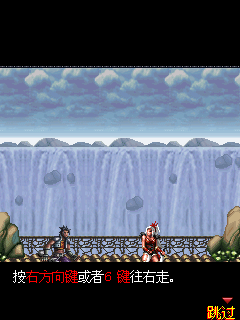

# 在线商店第三轮：继续处理剩余 317 项

接续[第二轮](2026-09-14-store-round2.md)，使用相同 2640 个 MD5 冻结包和相同冒烟设置。原 317 项中 **新增 4 项通过短冒烟，剩余 313 项未通过**。全量冒烟通过 2327/2640，原通过项回退 0 项。**这不是 317 项全部修复；#603 的持续操作仍失败。**

[2640 项原始结果](2026-09-14-store-round3.json) · [317 项逐项清单](2026-09-14-store-round3-issues.md) · [机器可读对照](2026-09-14-store-round3-comparison.json) · [持续运行与画面核验](2026-09-14-store-round3-detail.json)

## 全量结果

| 分类 | 第二轮 | 第三轮 |
|---|---:|---:|
| 短冒烟通过 | 2323 | 2327 |
| 运行异常 | 65 | 58 |
| 静态画面 | 163 | 166 |
| 来宾退出 | 56 | 56 |
| 黑屏 | 33 | 33 |
| 宿主超时 | 0 | 0 |

## 实际修改

- 按参考平台布局映射每实例独立、初始为零的 `0x40000000` 2 MiB 平台区与 `0x80000000` 18 MiB IO 区。#197/#236/#917 越过原非法地址并通过冒烟。主内存大小、指令预算、watchdog 不变，映射外访问仍抛错。这只是平台状态内存，并非全部硬件寄存器的仿真。
- 补齐 Lua `gui` 菜单、对话框、文本、编辑框和窗口接口及小写别名，复用真实宿主 UI、选择事件和编辑生命周期。按 UCS2-BE 解码字符串，保留参考返回值（包括部分更新函数成功时返回 nil）及按钮类型。
- 实现 `_com(407)` 暂停时定时器标志、`_com(500..504)` DSM 配置读写及初始化；配置保存在应用文件系统。`_platEx(1221)` 按参考返回空内容和 `MR_IGNORE`。
- 未指定启动文件且没有 `start.mr` 时，识别真实存在的 `_start.mr`；正常入口优先，显式入口不被替换。#782/#2359 能进入登录界面。
- `BitmapLoad` 按参考整图分支保留原始 RGB565 数据和声明尺寸，允许文件实际行数短于声明高度；不补造资源。绘制端现有有界读取返回零，裁剪加载仍校验边界。#160 原资源只有 80 行却声明 112 行；#603 原资源 38 行却声明 39 行。该修复消除了原加载异常，但不代表后续玩法已经兼容。

## 持续运行和画面

8 个样本执行独立操作序列及额外 60 秒虚拟时间。#197、#236、#782、#917、#2359、#2391 完成；#160/#603 仍异常。这里不将虚拟时间等同墙钟实时运行，也没有把 `needs-scene-review` 自动改为通过。

| Case | 核验结果 |
|---:|---|
| 197 RX管理器 | 磁盘信息界面可见，2 次控制窗口变化，987 ticks 完成 |
| 236 按键扫描实例 | 3 次控制窗口变化，987 ticks 完成；画面为按键测试块 |
| 917 魂之利刃 | 进入战斗教学，9 次控制窗口变化，987 ticks 完成 |
| 782、2359 股票软件 | 显示登录界面，分别 8 次控制窗口变化；在线登录与服务未验证 |
| 2391 应用软件 | 显示“点击更多游戏畅玩”提示，无控制窗口变化，保留待核验 |
| 603 俄罗斯方块 | 短冒烟通过；持续序列执行到 562 ticks 时 `SetTile(0,11,21,0)` 越界。地图为 11×22，线性索引 242 超过有效数组；未吞掉该错误 |
| 160 NES 模拟器 | 加载位图之后，在 `start.mr` PC100 调用缺失 `_bmpInfo(30)`；真实像素地址接口仍待实现 |

 

声音修复和 20 段 ADPCM 对照证据沿用[第二轮音频记录](2026-09-14-store-audio.json)。本轮完整测试包含现有音频回归，但没有新增全库听音或设备验证。

## 剩余问题与证据边界

58 项运行异常中：9 项指令预算超限、3 项堆损坏、3 项非法地址、2 项 sprintf 错误、1 项 Thumb 指令、1 项 `_bmpInfo` 缺口仍待处理。另有 15 项明确要求父启动平台、7 项缺 SDK 配置、11 项缺独立入口、3 项包损坏，以及 3 项缺 m0 平台槽依赖。

- #132 的 `*G` 和 #396/#975 的 `*J` 是平台预注册 m0 应用槽，分别为索引 6 和 9，不是退出标识。参考 `mythroad.c:1335–1416` 读取 `mr_m0_files[字母-'A']`，`:4417–4424` 由 `mr_registerAPP` 注册。当前包没有提供这些槽内容；不能拿当前包冒充。
- #1300 第 70 次 `sprintf("%s/%s")` 的第一参数为 `appbox/plug` 后接大量 `/`，扫描 70000 字节仍无 NUL。枚举接口与参考的终止语义暂未发现差异，不能证明宿主根因；保留未终止字符串错误。#1397 在固定键序仍报裸 `%`，另一短诊断提前退出，尚未收敛根因。
- #144/#145 越过主内存最后一个字节，循环根因尚未确定；没有增加主内存掩盖故障。
- 166 项静态画面、56 项退出、33 项黑屏仍需逐包核验真实入口、触屏、资源和退出原因；它们不是已证实的同一种模拟器故障。此前 #39/#41/#1683 触摸事件已送达，但尚未证明操作有效，未更改公共分发来猜测修复。

只读 Luna 探子参与了平台、GUI、内置包跳转、格式化/目录枚举及剩余项证据核验。最终源码修改、数字汇总和验证由主代理完成；探子的未确定结论没有当作修复证据。

## 验证与复现

- `npm test`：823 passed、1 skipped，153 文件中 152 passed、1 skipped。
- `npm run typecheck`：通过。
- 使用显式资源路径的生产构建和静态发布检查通过：1 个精选游戏，dist 414.0 MB。直接使用默认游戏目录的首次构建因找不到“白跑分.mrp”失败；按现有文档指定 `mrpfile` 后通过，未替换游戏文件。
- 新增平台内存、GUI 菜单/编辑事件、DSM 配置、入口优先级和位图边界回归；旧越界测试地址移动到新映射区外侧，保持越界抛错验证。
- [源码与资源哈希](2026-09-14-store-round3-inputs.json)包含未跟踪源文件，补充 runner 的 git diff 摘要。

```sh
MRP_STORE_CONCURRENCY=6 npm run test:store -- \
  artifacts/compat-20260914/store-manifest.json \
  /path/to/game-collection artifacts/compat-20260914/new-output
npm test
npm run typecheck
MRP_GAME_DIR="$PWD/mrpfile" MRP_RESOURCE_DIR=/path/to/mythroad_res npm run build
```

全量复测必须使用新的输出目录；保持资源目录、MD5 清单与固定输入一致。一次早期定向启动误用了资源根目录，已中止，该结果未纳入本文。最终 317 项复测与 2640 项回归都使用原基准资源目录。
